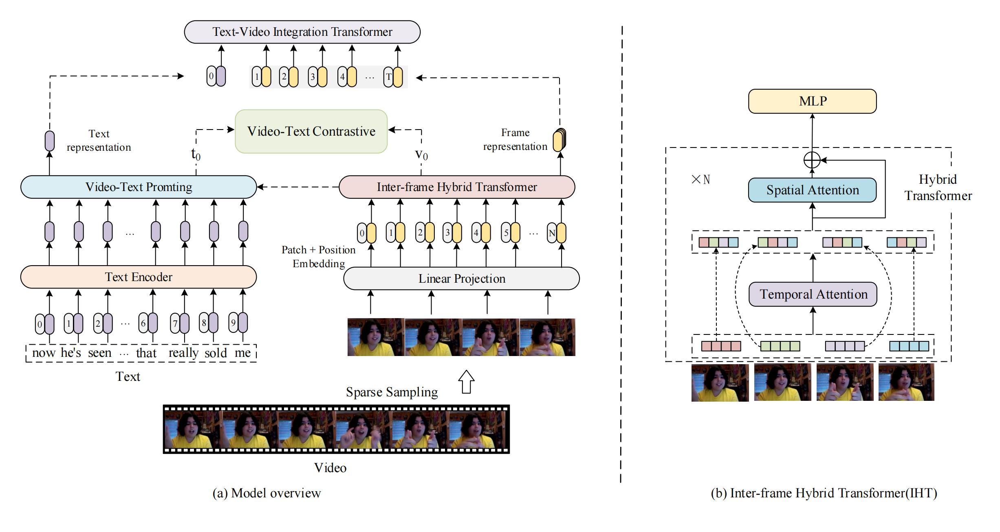

# VLP2MSA: Expanding vision-language pre-training to multimodal sentiment analysis

----
[[paper]](https://www.sciencedirect.com/science/article/abs/pii/S0950705123008869)



----
### 📝 Preparation 

Prepare environment

```python
git clone https://github.com/Yimi81/VLP2MSA.git
cd VLP2MSA
conda create -n vlp2msa python=3.7.10 -y
conda activate vlp2msa
pip install -r requirements.txt
pip install git+https://github.com/openai/CLIP.git
```

### 🔧 Download Datasets

You can download the datasets from [here](https://github.com/thuiar/MMSA?tab=readme-ov-file#2-datasets). Then you need to configure the `data_dir` field of the corresponding json file in the `configs` folder.


### 🏋️‍️ Run the Code

```python
python train.py --config ./configs/mosi.json
```

## 🎓 Cite

If our work is helpful to you, please cite:

```bibtex
@article{YI2024111136,
title = {VLP2MSA: Expanding vision-language pre-training to multimodal sentiment analysis},
journal = {Knowledge-Based Systems},
volume = {283},
pages = {111136},
year = {2024},
issn = {0950-7051},
doi = {https://doi.org/10.1016/j.knosys.2023.111136},
url = {https://www.sciencedirect.com/science/article/pii/S0950705123008869},
author = {Guofeng Yi and Cunhang Fan and Kang Zhu and Zhao Lv and Shan Liang and Zhengqi Wen and Guanxiong Pei and Taihao Li and Jianhua Tao}
}
```

## 🙏 Acknowledgements

This code is based of the frozen-in-time https://github.com/m-bain/frozen-in-time
